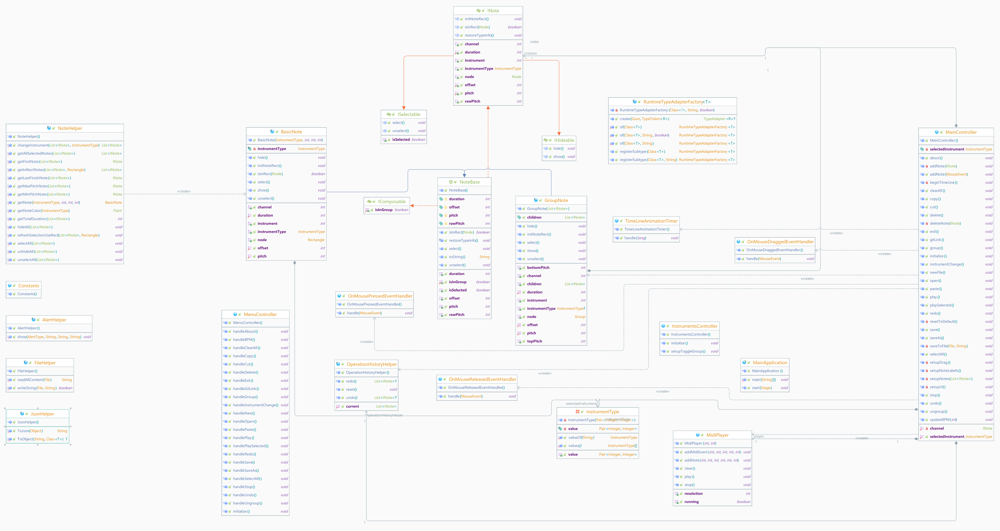

# MIDI Player 🎵

A feature-rich Java application for creating, editing, and playing MIDI compositions. It includes an intuitive interface for musicians and hobbyists to explore their creativity.

This project was developed as part of **Whitman College CS370**.

## Features

- **Comprehensive Menu Functions**: MIDI Composer offers an intuitive menu system with the following functionalities:

### File Menu
- **About**: View details about the application. *(Shortcut: ⌘I)*
- **Save**: Save the current composition. *(Shortcut: ⌘S)*
- **Save As**: Save the composition with a new name. *(Shortcut: ⇧⌘S)*
- **New**: Start a new composition. *(Shortcut: ⌘N)*
- **Open**: Open an existing composition. *(Shortcut: ⌘O)*
- **Exit**: Close the application. *(Shortcut: ⌘E)*

### Edit Menu
- **Undo/Redo**: Revert or reapply the last action. *(Shortcuts: ⌘Z / ⇧⌘Z)*
- **Select All**: Select all notes in the composition. *(Shortcut: ⌘A)*
- **Change Instrument**: Switch between different instruments for selected notes. *(Shortcut: ⌘T)*
- **Volume**: Adjust the volume level of notes.
- **Group/Ungroup**: Combine or separate notes into groups. *(Shortcuts: ⌘G / ⌘U)*
- **Cut, Copy, Paste, Delete**: Standard editing options for modifying notes. *(Shortcuts: ⌘X, ⌘C, ⌘V, ⌘⌫)*

### Action Menu
- **Play**: Play the entire composition. *(Shortcut: ⌘P)*
- **Play Selected**: Play only the selected notes. *(Shortcut: ⌘O)*
- **Stop**: Stop the playback. *(Shortcut: ⌘Y)*

- **Composition and Playback**: Add, edit, group, and play notes with real-time feedback.
- **Instrument Variety**: Choose from multiple instruments like Piano, Violin, and Guitar.
- **Visual and Interactive UI**: Utilize JavaFX for a polished user experience.
- **File Management**: Save and reload compositions as `.composer` files.
- **Advanced Utilities**: Leverage JSON serialization, undo/redo history, and custom MIDI event handling.

## How to Use

1. **Add Notes**: Click on the composition pane to place notes.
2. **Group and Edit**: Drag, group, and modify notes with ease.
3. **Change Instruments**: Use the instrument panel to select desired sounds.
4. **Playback**: Press play to hear your composition with animated feedback.
5. **Save and Load**: Save your work as `.composer` files and reload them anytime.

## Tech Stack

- **JavaFX**: For the graphical interface.
- **Maven**: Dependency and build management.
- **Gson**: JSON operations.
- **MIDI Library**: Custom `MidiPlayer` built with `javax.sound.midi`.

## Project Structure

### Core Components

- **`MainApplication`**: The entry point of the application, initializing the JavaFX stage.
- **`MidiPlayer`**: Manages MIDI sequences, adding events, and playback.

### Controllers and Interfaces

- **`Controllers`**:
  - `MainController`, `MenuController`, and `InstrumentsController` handle user interactions and business logic.
- **`Interfaces`**:
  - `INote`, `IComposable`, `IHideable`, and `ISelectable` define core functionality for musical notes and objects.

### Helpers

Utility classes for extended functionality:
- **`FileHelper`**: File operations for `.composer` files.
- **`JsonHelper`**: JSON serialization/deserialization for complex note objects.
- **`NoteHelper`**: Handles note creation, selection, and grouping.
- **`OperationHistoryHelper`**: Tracks undo/redo actions.

### Resources

- **FXML Files**: Define the UI layout for `Main.fxml`, `Menu.fxml`, and `Instruments.fxml`.
- **Module Configuration**: Managed in `module-info.java`.
- **Maven Configuration**: Dependencies and build setup in `pom.xml`.

## Architecture Overview

Below is the class diagram for the MIDI Player project, showcasing the structure and relationships between different components, including controllers, helpers, and interfaces:

## Contributors

- [Tina](https://github.com/pudding2718), [Paul](https://github.com/laolarou726), [Flora](https://github.com/florataagen), [Jess](https://github.com/Jess-Lilly)

